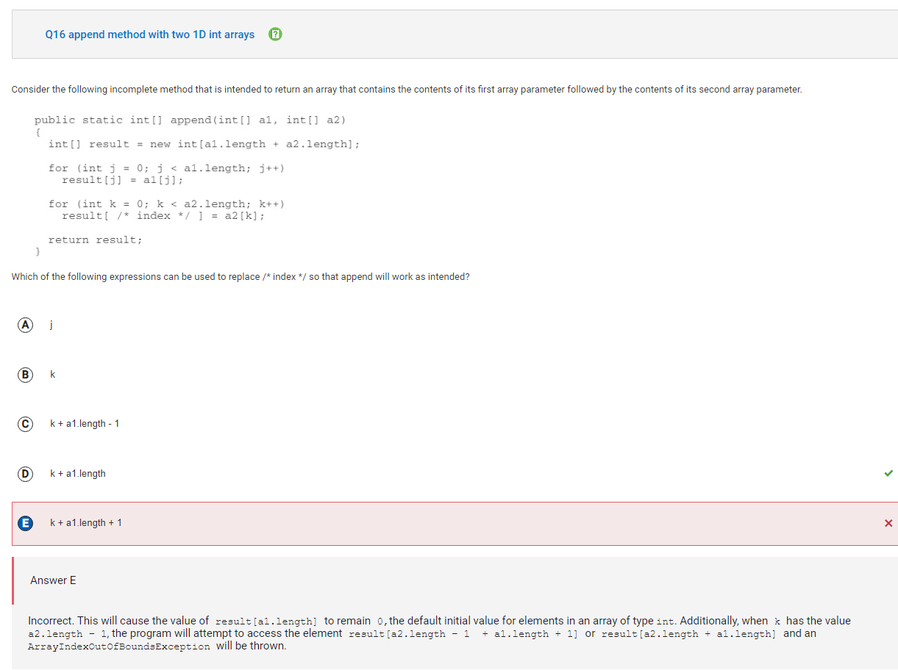

# 👇 2014 Collegeboard AP CSA Practice Exam Reflection and Corrections 👇

## Reflection:
I got a 23/40 in this exam and I think that the questions were definitely very difficult and needed a lot more thought. This made me realize that it's not a good idea to do these questions in my head because they always seem to trip people up. However, this is a learning opportunity because I get to know what the questions really look like in the AP exam and I can practice my approach to answering each of them.
The topics that I most struggled on were arrays and recursive functions. After taking this practice exam, I now feel that it's very important to write down the steps on paper to have an idea of what is going on in the complex code instead of doing it mentally and making mistakes.

### Q4

Answer is C because the result of two integers being divided in this case is also an integer, so the answer is 2 and not 2.3333...

### Q10

Answer is B (II only) because if the array had only one element (5), then that would also be the target. If the array did not have the integer 5, then there would be no target and an error will occur.

### Q15

Answer is A (I only) because the else statement may cause the loop to terminate, only resulting in data[0] and data[1] being checked.

## Q16

Answer is D because trying to access result[a2.length - 1 + a1.length + 1] which is the same as result[a2.length + a1.length] would result in an index out of bounds exception.

## Q21

Answer is D because since an enhanced for loop is being used, we don't need to use row[num] and instead we could just use num.

## Q22

Answer is B because Line 4 cannot compile since the array is of type Book and only methods from the class "Book" can be called in an element of the array. Line 2 would still work because objects of subclasses can be assigned to variables of the type of superclass.

## Q23 

Answer is B.
Iteration 1: k = 5 and animals[5] = "baboon". Baboon starts with a b so it is put in index 1. The list is now: {"bear", "baboon", "zebra", "bass", "cat", "koala"}
Iteration 2: k = 4 and animals[4] = "cat". Cat doesn't start with a b so it stays in the same place. The list remains the same.
Iteration 3: k = 3 and animals[3] = "bass". Bass starts with a b so it is put in index 3. The list remains the same.
Iteration 4: k = 2 and animals[2] = "zebra". Zebra doesn't start with a b so it stays in the same place. The list remains the same.
Iteration 5: k = 1 and animals[1] = "baboon". Baboon starts with a b so it is put in index 1. It essentially stays at the same place and the list remains the same.

## Q26

Answer is A because again, we are using a for each loop and we can use (x % 2 != 0) instead of (arr[x] % 2 != 0).

## Q28

Answer is D. x can be 1 at Point C because if n was lesser than or equal to 2, the loop would be skipped and it will print out the value of x, which is 1. At Point B however, n has to always be greater than 2 because that would allow the while loop to actually run.

## Q30

Answer is C. The first substring is from 3 + 1 = 4 to the word's length, which is 7. Essentially, this is from index 4 to index 6 which outputs "iler". The second substring is from 0 to 3 and since 3 is excluded, the second part will be "com". Concatenating these two substrings will output "ilercom".

## Q33

Answer is E because k is never being incremented and therefore the value of k stays at 1, and always less than 4. The sum will eventually exceed 12 but since there is an OR condition in the while loop, the while loop would become an infinite loop.

## Q34

Answer is B (II only). Option III is incorrect because it is trying to directly get the x and y values of the point and change their values. This doesn't work because x and y are defined as private variables. The correct way to set the x and y values is to use the two-parameter constructor and specify the values.

## Q36

Answer is C (8, 9, 11) because 8 is an even number so y becomes equal to 3. 11 is greater than 9 so y becomes equal to 5. 9 is neither even nor greater than 9, so y becomes equal to 1.

## Q37

Answer is D (I and III only). II is wrong since x is initialized to 1 and is incremented by 2 each iteration. It would anyways skip the value 6 and the loop would be infinite. III is correct because the loop will stop before x reaches 7, outputting the values 1, 3, and 5.

## Q38

Answer is A because there has to be the && operator between (y > 10000 || x > 1000) and (y > 10000 | | x < 1500). This is because the expression (y > 10000) || (x > 1000 && x < 1500) is distributed in the following way:

## Q39

Answer is D:
Since 27 is not less than or equal to 10, recur(recur(27/3)) is called, which is recur(recur(9)). recur(9) will be 18 so recur(recur(9)) is the same as recur(18).
Since 18 is not less than or equal to 10, recur(recur(18/3)) is called, which is recur(recur(6)). recur(6) will be 12 so recur(recur(6)) is the same as recur(12).
Since 12 is not less than or equal to 10, recur(recur(12/3)) is called, which is recur(recur(4)). recur(4) will be 8 so recur(recur(4)) is the same as recur(8).
Since 8 is less than 10, the final value of n will be 8*2 = 16.

## Q40

Answer is C:
Call 1: whatsItDo("WATCH")
- len = 5 → len > 1
- temp = "WATCH".substring(0, 4) = "WATC"
- Recursive call: whatsItDo("WATC")

Call 2: whatsItDo("WATC")
- len = 4 → len > 1
- temp = "WATC".substring(0, 3) = "WAT"
- Recursive call: whatsItDo("WAT")

Call 3: whatsItDo("WAT")
- len = 3 → len > 1
- temp = "WAT".substring(0, 2) = "WA"
- Recursive call: whatsItDo("WA")

Call 4: whatsItDo("WA")
- len = 2 → len > 1
- temp = "WA".substring(0, 1) = "W"
- Recursive call: whatsItDo("W")

Call 5: whatsItDo("W")
- len = 1 → len <= 1
- Base case reached, recursion stops. This call returns without printing anything.

Now the method starts returning and the substrings(temp) are printed in reverse order of creation:
1. Returning from Call 4:
- Prints temp = "W"
2. Returning from Call 3:
- Prints temp = "WA"
3. Returning from Call 2:
- Prints temp = "WAT"
4. Returning from Call 1:
- Prints temp = "WATC"