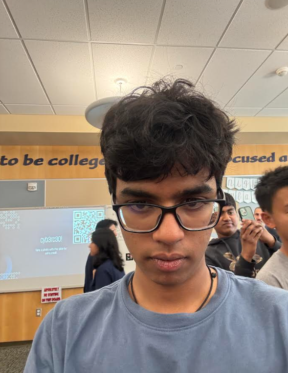
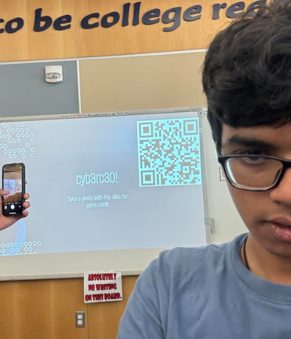

# Notes:

### Tricia Mercer:
- Cybersecurity is more about people and connections than just hacking
- Small mistakes can lead to big problems
- You need to be honest because you're dealing with private data
- It's important to stay aware and communicate well
- Start early and build relationships in the field

### David Tomasz:
- Learn from real-world examples
- Privacy for both people and the country matters a lot
- The government is always trying to stop hackers
- Cybersecurity requires quick thinking and fast decisions

### Victor Nzeata
- The government works hard to catch cyber threats
- Protecting privacy is very important
- Fast decisions are key in this field
- Real-world cases help you learn better

### A few facts:
- you get a lot of satisfaction after you track someone down after a long time
- Ransomware is when you encrypt a victim's files and demand money to give access again
- China steals over $100B each year in intellectual property

